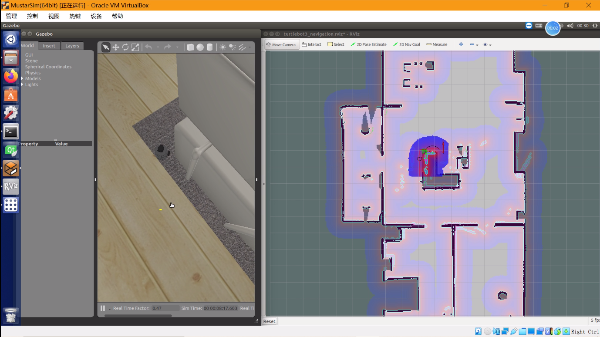

# Mobile Robot Simulation

Realized the autonomous navigation of a mobile robot through simulation environment, navigation and positioning function, optimal point-to-point path planning and local real-time planning based on ROS navigation package and Gazebo. Carried out the scanning and navigation path planning of a given simulation environment in milliseconds, moved the car to a specified location and adjusted the planning of routes as the car moves.

## Requirements

Ros

Gazebo

## Getting Started

Open simulations world

```
roslaunch turtlebot3_gazebo turtlebot3_world_small_bringup.launch
```

Build map

```
roslaunch turtlebot3_slam turtlebot3_slam.launch slam_methods:=gmapping
roslaunch turtlebot3_teleop turtlebot3_teleop_key.launch
```

Save map

```
cdsrc/turtlebot3/turtlebot3_navigation/maps
rosrun map_server map_saver -f map
```

Start navigation

```
roslaunch turtlebot3_gazebo turtlebot3_world_small_bringup.launch 
roslaunch turtlebot3_navigation   turtlebot3_navigation.launch 
```

## Result

